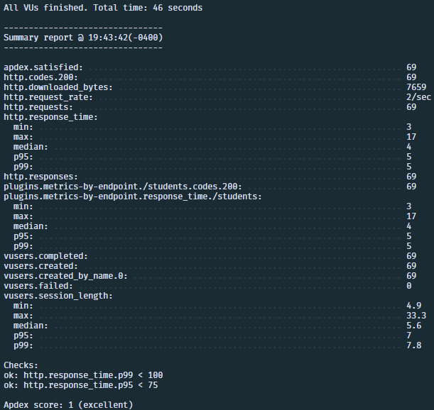

# Desafío IACC Backend

## Requerimientos

- [Docker](https://www.docker.com/products/docker-desktop/)

## Instalación

1. Crear una copia del archivo `.env.example` y renombrarlo a `.env` en el directorio base

2. Correr los siguientes comandos en la terminal:

    ```bash
    # Instalar node_modules
    $ npm install

    # Levantar contenedores de docker
    $ docker compose up -d --build
    ```

3. Probar si se levantó el servicio correctamente con CURL

    ```bash
    # Output: Pong!
    $ curl --location 'http://localhost:3000/ping'
    ```

## Endpoints

### Estudiantes

```bash
# Crear un estudiante
$ curl --location 'http://localhost:3000/students' \
--header 'Content-Type: application/json' \
--data-raw '{
    "firstName": "Juan",
    "lastName": "Perez",
    "email": "juanperez@gmail.com",
    "age": 23,
    "address": "La Cisterna"
}'

# Obtener una lista de estudiantes
$ curl --location 'http://localhost:3000/students'

# Buscar un estudiante según su ID
$ curl --location 'http://localhost:3000/students/1'

# Editar un estudiante según su ID
$ curl --location --request PATCH 'http://localhost:3000/students/1' \
--header 'Content-Type: application/json' \
--data '{
    "age": 24
}'

# Eliminar un estudiante según su ID
$ curl --location --request DELETE 'http://localhost:3000/students/1'
```

### Cursos

```bash
# Crear un curso
$ curl --location 'http://localhost:3000/courses' \
--header 'Content-Type: application/json' \
--data '{
    "name": "Biología 1",
    "code": "B1",
    "year": 2023,
    "semester": 1,
    "campus": "Toesca"
}'

# Obtener una lista de cursos
$ curl --location 'http://localhost:3000/courses'

# Buscar un curso según su ID
$ curl --location 'http://localhost:3000/courses/1'

# Editar un curso según su ID
$ curl --location --request PATCH 'http://localhost:3000/courses/1' \
--header 'Content-Type: application/json' \
--data '{
    "semester": 2
}'

# Eliminar un curso según su ID
$ curl --location --request DELETE 'http://localhost:3000/courses/1'

# Enrolar un estudiante en un curso
$ curl --location 'http://localhost:3000/courses/1/students' \
--header 'Content-Type: application/json' \
--data '{
    "studentId": 1
}'
```

## Artillery

```bash
# Test de Artillery a endpoint de estudiantes
$ npm run artillery:students
```


